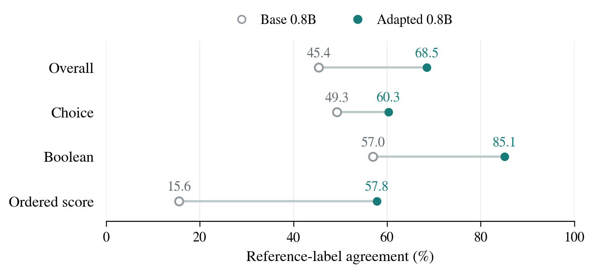

# VisionJev

**面向快速结构化视觉决策的小型多模态模型。**

[English](README.md) | 简体中文 · [DriveJev 驾驶应用分支](https://github.com/derekshiii/VisionJev/tree/drivejev)

**项目站点：** 尚未上线 —— 静态站点已在本仓库中构建完成，等待配置 GitHub Pages。上线之前，本 README 是主要入口。

VisionJev 是本仓库的通用多模态研究方向。我们 build on [Bespoke Nimble](https://github.com/bespokelabsai/nimble)，利用 Qwen3.5 原生视觉语言骨干，将文本单模态决策流程扩展到图像与文本判断标准。受到 [Jev](https://typesafe.ai/blog/introducing-system-one-models-and-jev) 启发，我们希望模型直接返回软件可以使用的决策。

研究路线调整为 **视觉证据 → 结构化判断 → 下游动作**：首先提升通用视觉决策，再通过 **DriveJev** 迁移到自动驾驶。

**研究预览。** 当前公开仓库包含项目文档与已评测结果；模型代码正在整理发布。通用多模态研究在 `visionjev` 推进，已有驾驶工作保留在 `drivejev`。

## 研究动机

图像应用经常需要一个具体判断：哪个选项匹配目标、某个条件是否在画面中成立、两个物体处于什么空间关系。紧凑的决策模型可以直接给出答案，由应用代码决定后续行为。

核心问题是：小模型是否依据相关的视觉证据作出判断？只看答案正确率，难以区分视觉理解与语言先验。因此，我们重点研究依赖图像的任务、换图后答案随之改变的配对样本，以及视觉 token 预算对质量和延迟的影响。

首要对象是 **Qwen3.5-0.8B**，9B 作为容量参照。实验优先适应有限算力：冻结视觉编码器、语言侧适配、紧凑输入和少量有明确假设的对照。

## 研究路线

| 阶段 | 核心问题 | 进展 |
| --- | --- | --- |
| 文本决策 | 小模型能否学会有限选项决策接口？ | 0.8B、9B 文本复现完成 |
| 多模态输入 | 真实图像是否正确进入训练与决策推理？ | 已验证训练、重载和真实单图推理 |
| 视觉决策质量 | 模型是否使用了问题所需的视觉证据？ | 当前研究重点 |
| 视觉决策效率 | 完成判断需要多少视觉计算？ | 计划开展受控 token 预算与适配实验 |
| 驾驶迁移 | 视觉提升能否改善规划判断？ | 已有 NAVSIM 结果保留在 DriveJev 分支 |

## 多模态基础

现有实现结合 Qwen3.5 视觉编码器、图像 token 展开、语言侧 LoRA 与答案 token 评分。已汇报驾驶模型冻结视觉编码器，联合图像和文本状态进行决策。

真实 0.8B 单图推理已在 **1,008 个视觉 token** 配置下通过验证；已完成的驾驶评测使用 **364 个视觉 token**。这是不同图像处理预算，新研究将在统一任务和训练协议下比较预算。

| 输入 | 判断任务 | 应用输出 |
| --- | --- | --- |
| 图像＋候选选项 | 视觉匹配 | 候选身份 |
| 图像＋条件描述 | 视觉条件判断 | 是／否 |
| 图像＋对象或区域 | 空间关系判断 | 预定义关系 |

上表定义接下来要建立的任务集，目前尚无通用视觉 benchmark 成绩。

## 文本决策基础

使用 2,676 条训练样本与 324 条留出样本，我们在两种模型规模上复现了 Nimble 训练配方。

| 模型 | 基座 | 适配后，原始实验 | GPU 独立复评 |
| --- | ---: | ---: | ---: |
| Qwen3.5-0.8B | 45.37% | **68.52%** | 68.21% |
| Qwen3.5-9B | 66.05% | **87.04%** | 87.35% |

<p align="center">
  
</p>

*图中为 0.8B 原始分任务成绩。两个模型的独立复评分别与原始成绩相差一个平局样本。这些是文本留出集成绩，不是视觉 benchmark 成绩。*

## 接下来做什么

1. **视觉证据利用**：比较真实图像、匹配条件下的换图，以及独立训练的纯文本基线；相关图片和问题变体必须一起划分。
2. **Token 效率**：固定数据与训练曝光量，对比两档实测视觉 token 预算，单列小目标和空间关系表现。
3. **模态适配**：首先冻结视觉编码器、仅训练语言侧 LoRA；定位具体限制后，再扩展可训练组件。
4. **泛化**：测试新场景、新对象与新问题模板，并检查选项顺序敏感性和各任务表现。
5. **驾驶迁移**：将选定视觉适配迁入 DriveJev，在相同候选池和训练量下与对照比较。

首轮协议及分支工作方式见[多模态研究计划](docs/MULTIMODAL_PLAN_CN.md)。

## DriveJev：下游驾驶应用

[DriveJev 分支](https://github.com/derekshiii/VisionJev/tree/drivejev)保留驾驶方法、图表与已完成的 NAVSIM 评测。其多模态 0.8B、9B 在 12,146 个 navtest 场景上分别达到 **0.5116、0.5351 PDM**，H800 推理中位延迟分别为 **182 ms、335 ms**。

后续通用视觉改进将迁入该分支，在匹配的驾驶条件下检验。研究重点是明确哪些改进能迁移，而不是假设视觉 benchmark 分数提高就必然带来驾驶收益。

## Citation / 引用

使用本研究分支时，请引用 VisionJev，并记录**分支、代码 revision、模型或 adapter revision，以及数据集 release 或 split manifest**。使用驾驶实验时，请另外引用 DriveJev。

```bibtex
@misc{visionjev2026,
  author = {{VisionJev Contributors}},
  title  = {{VisionJev}: Small Multimodal Models for Structured Visual Decisions},
  year   = {2026},
  url    = {https://github.com/derekshiii/VisionJev}
}
```

[CITATION.cff](CITATION.cff) · [参考文献](references.bib)

## 致谢

本项目基于 [Bespoke Nimble](https://github.com/bespokelabsai/nimble) 与 Qwen3.5，受到 [Jev 的 System One 接口](https://typesafe.ai/blog/introducing-system-one-models-and-jev)和 [OpenJev](https://zefan-cai.github.io/open-jev/) 启发。驾驶评测使用 [NAVSIM](https://github.com/autonomousvision/navsim)。
