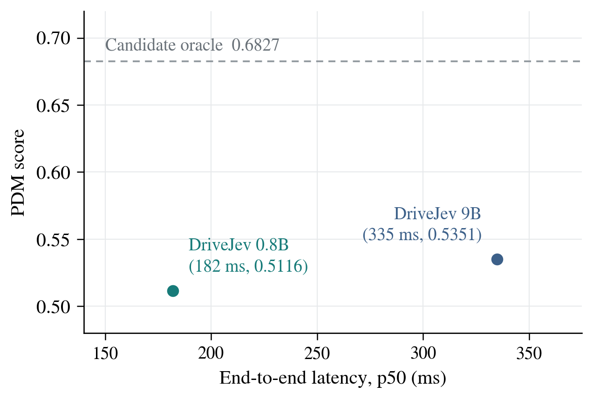

# DriveJev

**面向自动驾驶的快速多模态决策。**

[English](README.md) | 简体中文

DriveJev **builds on [Bespoke Nimble](https://github.com/bespokelabsai/nimble)**，将其**文本单模态决策接口**扩展到视觉观测与车辆状态。DriveJev 联合处理**图像、文本判断标准与车辆状态**，输出可直接使用的结构化决策。基于 Qwen3.5 视觉语言骨干，我们沿着 **文本决策 → 视觉理解 → 自动驾驶决策** 的路径进行适配与优化。

**计划于 2026 年 9 月 23 日开源代码。**

## 为什么做 DriveJev

驾驶需要持续作出具体判断：保持速度还是减速，沿用当前轨迹还是根据场景变化调整计划。这些决策接近轨迹执行层，判断的准确性与产生判断所需的时间同样重要。

受到 [Jev 的 System One 接口](https://typesafe.ai/blog/introducing-system-one-models-and-jev)启发，我们将“输入上下文、输出结构化决策”的方式引入视觉驾驶场景。

我们希望在感知与运动规划之间构建一个紧凑的决策模块：理解当前场景，输出规划代码可以直接使用的有限选项判断。DriveJev 直接读取允许答案的分数，使这条决策路径无需生成推理长文或解析自由格式回答。

我们探索 **0.8B 小模型**能够承担多少决策能力，以 **9B 作为容量参照**，同时衡量驾驶质量与端到端延迟。目前从轨迹选择切入，下一步评价并按需修正规划器的输出。轨迹生成与车辆控制仍由系统中明确的模块负责。

## 文本 → 视觉 → 驾驶

| 阶段 | 学习目标 | 当前进展 |
| --- | --- | --- |
| **文本决策** | 根据上下文与判断标准完成选择、布尔判断、有序评分 | 已在 0.8B 与 9B 上复现 Nimble 配方 |
| **视觉理解** | 将图像证据接入同一结构化决策接口 | 已贯通图像条件下的训练、推理与权重重载 |
| **自动驾驶决策** | 结合道路观测、自车运动与计划选择动作 | 已完成多模态 NAVSIM 轨迹选择评测 |

Nimble 提供了结构化文本决策的起点。DriveJev 将 Qwen3.5 原生视觉能力接入这一流程，再通过驾驶观测和轨迹监督进行适配。当前八选一任务在一次 prompt prefill 后同时读出所有答案分数。

## 多模态能力

DriveJev 将 **Qwen3.5 原生视觉编码器**与语言侧 LoRA 适配结合。已汇报的驾驶模型冻结视觉编码器，适配后的语言模型同时接收图像 token、车辆状态与候选计划。

| 组成 | 当前实现 |
| --- | --- |
| 视觉输入 | 真实前视相机图像，采用官方 PIL 图像处理后端 |
| 驾驶上下文 | 自车状态、运动历史、导航指令与候选轨迹 |
| 视觉预算 | 驾驶 checkpoint 使用 **364 个图像 token** |
| 决策输出 | 候选 ID 及给定选项上的概率分布 |
| 训练流程 | 训练与推理共享图像处理流程，已验证 checkpoint 重载 |

0.8B 与 9B 均已贯通多模态流程。合成视觉任务用于检查图像路径，驾驶实验进一步检验视觉信息对真实场景决策的价值。

## 文本决策结果

使用 **2,676 条训练样本**适配后，0.8B 在 **324 条留出样本**上的参考标签匹配率从 **45.4% 提升到 68.5%**，增加 **23.1 个百分点**。我们的 **9B 文本复现从 66.05% 提升至 87.04%**，采用相同的 324 条留出集。

<p align="center">
  
</p>

*在 Nimble 留出集上的文本适配结果。每条线连接同一任务上 0.8B 基座与适配模型的成绩，数值单位为百分比。*

| 模型 | 适配前 | 适配后 |
| --- | ---: | ---: |
| DriveJev 0.8B · 文本 | 45.37% | **68.52%** |
| DriveJev 9B · 文本 | 66.05% | **87.04%** |

作为背景，[Nimble 官方发布结果](https://github.com/bespokelabsai/nimble#evaluation-on-324-held-out-examples)中，Bespoke-Nimble-9B 与 Jev 1.13.0 在其 324 条留出集上的成绩分别为 **90.12%** 和 **93.21%**。

## 多模态驾驶结果

模型联合接收**前视图、自车状态、运动历史、导航指令与八条候选轨迹**。候选根据当前车辆状态生成，模型通过结构化决策接口选择计划。

在 **12,146 个 NAVSIM navtest 场景**上，0.8B 模型达到 **0.5116 PDM**，端到端推理中位延迟为 **182 ms**；9B 模型达到 **0.5351 PDM**，中位延迟为 **335 ms**。

<p align="center">
  
</p>

*驾驶质量与推理延迟的关系：越靠左上越好。虚线表示离线评测下八条候选中的最佳分数。*

| 模型 | PDM ↑ | 延迟 p50 ↓ | 延迟 p95 ↓ |
| --- | ---: | ---: | ---: |
| DriveJev 0.8B · 多模态 | 0.5116 | **182 ms** | 191 ms |
| DriveJev 9B · 多模态 | **0.5351** | 335 ms | 341 ms |
| 候选池 oracle | 0.6827 | — | — |

**评测设置。** 基于 NAVSIM v1 快照开展本地项目评测，覆盖 136 个 logs、12,146 个场景，无缺失或失败预测。PDM 使用 0–1 标度，采用非反应式回放。oracle 根据离线评分选择最佳候选。9B 的配对优势约为 +0.0236 PDM，按 log 聚类 bootstrap 的 95% 区间为 [+0.017, +0.031]。所选 0.8B 与 9B 模型分别经过两轮和一轮驾驶适配。

**延迟设置。** H800、BF16、batch=1，LoRA adapter 未合并；200 个场景、三轮交错测量，剔除 30 次预热后共 570 次计时。端到端计时采用 CUDA 同步，包含 JPEG 解码、缩放与归一化、tokenize、prefill 与答案读出；不含图像下载、冷启动与 PDM 评分。

## 优化路径

当前实验指向三个相互衔接的重点。

| 方向 | 实验观察 | 下一步 |
| --- | --- | --- |
| **更强的文本决策** | 小模型适配显著提升结构化判断能力 | 优化监督、候选表达与训练效率 |
| **更有效的视觉理解** | 开发集上，9B 从文本输入的 0.6173 提升至有图的 0.6936 | 研究视觉 token 预算、模态对齐和各类决策需要的环境信息 |
| **更好的驾驶决策** | 模型选择能力与候选覆盖共同影响最终 PDM | 泛化到陌生计划，评价风险与效用，进行受约束的规划修正 |

对于 0.8B，初轮有图与纯文本模型表现接近，增加多模态训练后成绩提升。因此，**匹配训练量、提高视觉证据的利用效率**是下一阶段的重点。当前开发实验中，视觉预算从 364 增至 1,008 个 token 没有提高成绩，我们正在研究如何用更少的 token 保留对决策有用的场景信息。

驾驶适配将从**选择计划**推进到**评价给定计划**，再到**只在有帮助时修正计划**。我们会同时测量纠错收益、误改代价、行驶进度、舒适性和延迟。下一步通过包含执行延迟的闭环评测，检验快速决策在驾驶中的实际价值。

**研究进展 · 9 月 22 日。** 轨迹评价实验正在推进：初步 ego 输入与轻量网络实验已完成，图像条件下的评价模型正在训练。更大规模的优化实验已准备 **30,272 个场景的标签**与 **57,668 帧图像**，全量评测仍在进行。上方结果表保留已完成的文本与 NAVSIM 实验；闭环评测为下一阶段。

## 开源计划

**2026 年 9 月 23 日——计划开源代码。**

本次发布将围绕文本到多模态的适配流程与驾驶实验展开。轨迹评价和规划修正相关工作将随研究进展持续更新。

## Citation

```bibtex
@misc{drivejev2026,
  author       = {{DriveJev Contributors}},
  title        = {{DriveJev}: Multimodal Decision Models for Autonomous Driving},
  year         = {2026},
  howpublished = {\url{https://github.com/derekshiii/DriveJev}},
  url          = {https://github.com/derekshiii/DriveJev}
}
```

## 致谢

本项目基于 [Bespoke Nimble](https://github.com/bespokelabsai/nimble) 与 Qwen3.5，使用 [NAVSIM](https://github.com/autonomousvision/navsim) 评测驾驶结果，并受到 [Jev](https://docs.typesafe.ai/concepts/state) 与 [OpenJev](https://zefan-cai.github.io/open-jev/) 结构化决策接口的启发。
